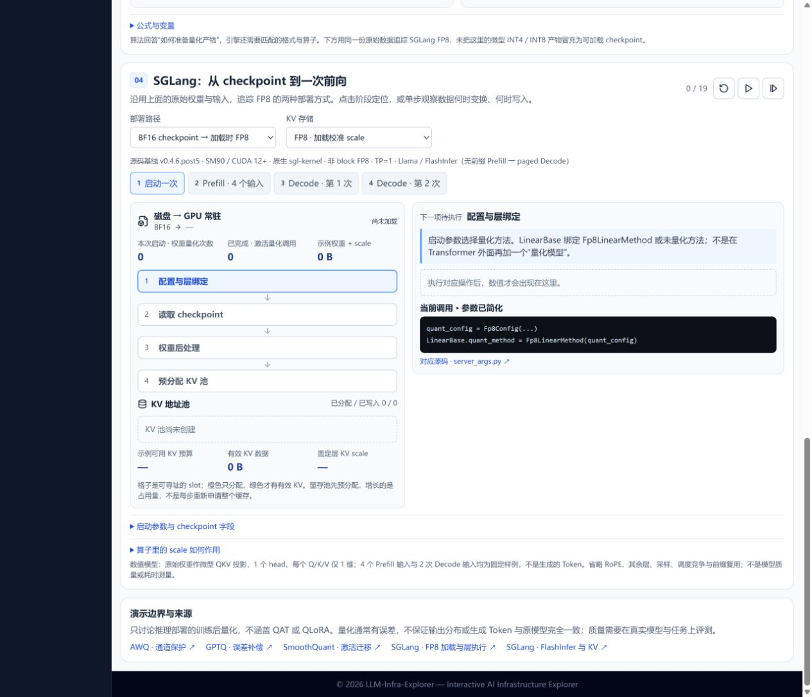
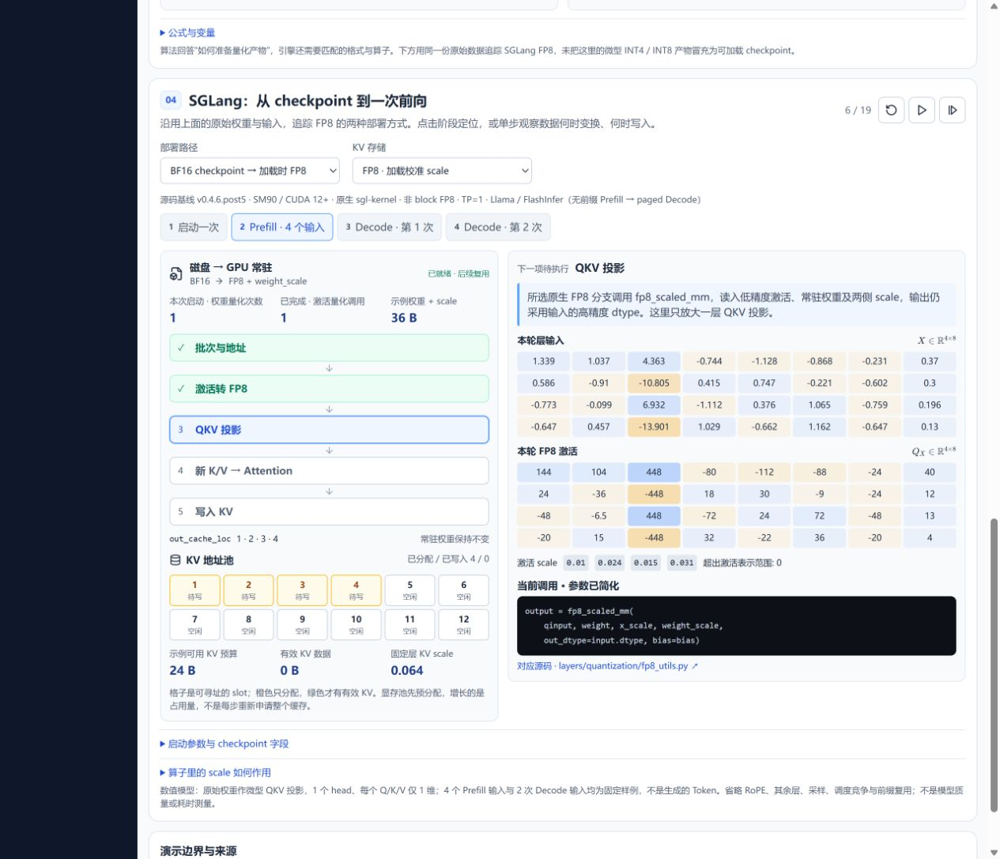
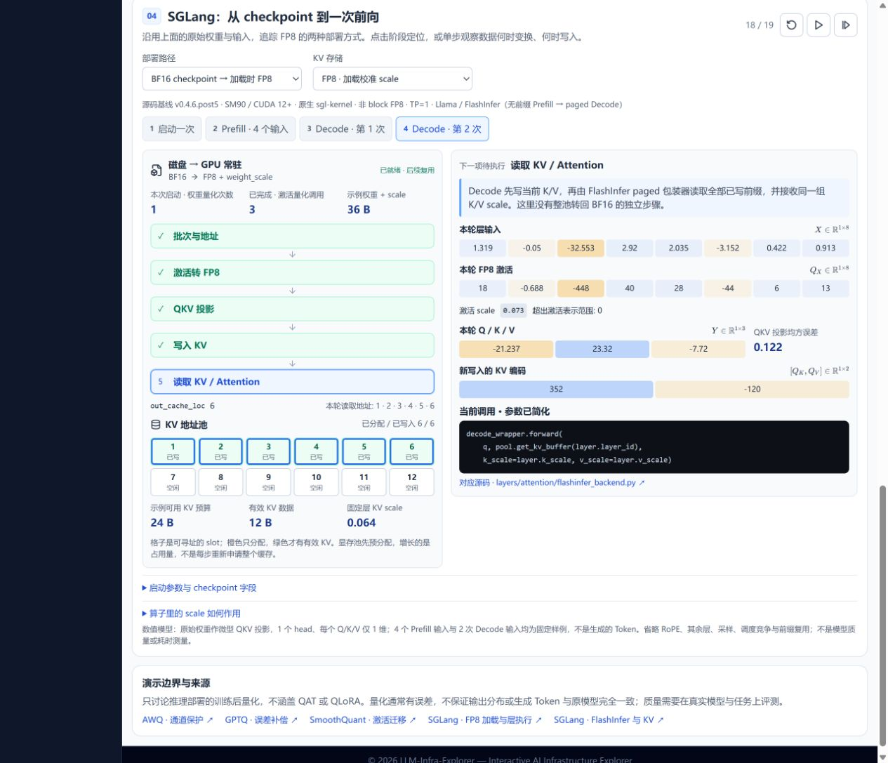

# 量化推理工作台：视觉与交互复查

日期：2026-09-06。范围：现有第四块引擎工作台的学习路径与桌面呈现；本轮不修改应用代码。

## 结论

现有实现已经包含加载、激活转换、Prefill/Decode 和缓存读写，但主要把运行步骤逐条高亮，尚未把这些操作发生在什么对象上、对象之间如何传递数据直观地连接起来。建议保留数值模型和已核对的引擎时序，重新组织第四块主画面；不扩展成完整 Transformer 架构课程，也不重做前三块。

## 截图与发现

### 1. 启动：信息准确，入口偏实现名词（高优先级）

- 健康点：能区别 checkpoint、常驻权重、量化次数和缓存预分配。
- 问题：标题、版本及实现类名先于数据关系出现；左侧是纵向步骤，右侧代码下有空白，尚未建立后续一直复用的权重位置。读者首先读到的是引擎操作日志。
- 建议：标题改为“量化在推理中如何生效”；品牌、固定版本与硬件条件移入次级“实现依据”。主图从一开始保留 checkpoint、常驻权重、线性算子和 KV 池的位置。

### 2. Prefill：数值可见，数据依赖需靠读者拼接（高优先级）

- 健康点：四行激活及各行 scale 已显示，槽位预留与写入也已区分。
- 问题：激活矩阵在右侧、步骤在左侧，GEMM 使用的权重只有文字摘要，没有与激活汇入同一算子的可见连接。精度变化主要靠标签解释。
- 建议：固定“激活 → 量化 → Linear”路径，常驻权重从旁汇入；选中一行即可追踪转换前后值和 scale。用数据载荷宽度/位数表达存储压缩，不改变张量的逻辑行列数。

### 3. Decode：缓存增长真实，但读写关系不突出（中优先级）

- 健康点：已有六个写入槽和读取边框，不是纯装饰缓存。
- 问题：旧槽和新增槽完成后外观相近；没有缓存到 Attention 的数据连线。阶段切换又替换步骤列表，用户需要记住权重仍在复用。
- 建议：旧 KV 保持原位，新增槽短暂标记“本轮新增”；以明确方向分别展示写入和读取。让四行 Prefill 激活变为一行 Decode 激活，同时常驻权重不变、KV 前缀增长。

## 建议的最小改版

1. 一条紧凑时间轴：离线产物 → 加载一次 → Prefill → Decode 循环。离线部分只与现有第三块衔接，不重复展开。
2. 一张固定的数据流主图：checkpoint、权重准备、GPU 常驻权重、当前激活、量化 Linear、Q/K/V、Attention、KV 池。只画解释量化所需的局部层结构。
3. 三类对象各自展示生命周期：权重准备后复用；激活随每次前向重新产生与转换；KV 持续留存、追加并读取。
4. 右侧改成小型对象检查器：跟随当前选中对象展示 dtype、scale、一个数值例子和误差；完整矩阵、公式和源代码按需展开。
5. 控件强调因果：切换权重加载路径改变启动流；切换激活 scale 策略改变 scale 来源/更新；切换 KV 格式改变存储载荷和容量。不要把“运行时量化”画成激活量化之后的另一道独立阶段。

## 技术边界与验收建议

- 保留已核对的固定 SGLang 版本作为实现依据，不把特定后端分支推广为所有推理引擎的统一执行顺序。
- 现有无前缀 Prefill 与 Decode 的 Attention/KV 写入顺序不同；重排视觉不能改变真实依赖。
- 区分量化发生时间与 scale 确定时间；固定 scale 不意味着没有运行时转换。
- 容量压缩不冒充实测加速。当前小矩阵、固定输入、JavaScript 数值计算均为教学示例。
- 改版后应验证：无需读代码就能指出权重何时转换、激活何时转换、旧 KV 如何复用；播放/步进/定位保持一致；窄屏无溢出；状态不能仅靠颜色区分。
- 本轮实际检查 1280×1100 中文桌面启动、Prefill、第二次 Decode 三态，无页面横向溢出。不是全配置、移动端或键盘/屏幕阅读器完整审查；本轮未修改应用，因此未重跑构建及数值回归。三张截图均由当前运行页面捕获并检查保存文件。
